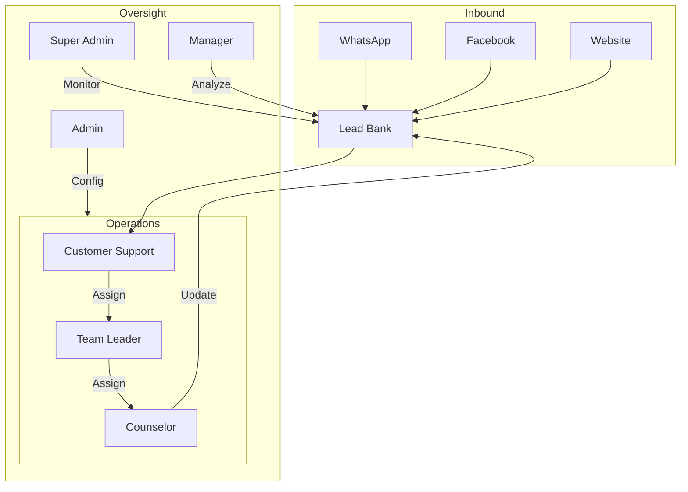

# CRM Dashboard & Flow Analysis

This document outlines the architecture of the Multi-Channel CRM, describing how each user role interacts with the system and specifying the requirements for the backend API.

## 1. System-Wide Data Flow
The CRM follows a "Lead Lifecycle" flow:
1.  **Ingestion**: Leads enter via WhatsApp, Facebook, or Website Widget (Admin Setup).
2.  **Triage**: New leads appear in the **Customer Support** queue.
3.  **Dispatch**: **Super Admin/Admin** (or Support) assigns leads to specific Teams or Counselors.
4.  **Management**: **Team Leaders** monitor their team's performance and redistribute leads if SLA breaches occur.
5.  **Execution**: **Counselors** engage with leads, update stages, and log calls.
6.  **Analytics**: **Managers** review performance funnel and conversion stats.

---

## 2. Role-Specific Dashboards

### 2.1 Super Admin (Full System Control)
**Main Goal**: Platform health, billing, and global oversight.

| Menu | Purpose | Backend / Table |
| :--- | :--- | :--- |
| **Overview** | High-level system metrics. | `Users`, `Leads`, `Billing` |
| **All Channels Control**| Global toggle for all communication nodes. | `Setting` (key: CHANNEL_*) |
| **Billing & Plans** | Subscription management. | `Billing` |
| **Audit Logs** | Security oversight of all actions. | `AuditLog` |
| **Global Users** | CRUD for all users in the system. | `User` |
| **System Analytics** | Performance across all client nodes. | `Lead`, `Activity` |
| **Admin Management** | Managing client/admin accounts. | `User` (role: ADMIN) |
| **Security Settings** | Global Auth and IP restrictions. | Config / Settings |

---

### 2.2 Admin (Configuration Layer)
**Main Goal**: Setting up the "Infrastructure" for their specific organization.

| Menu | Purpose | Backend / Table |
| :--- | :--- | :--- |
| **Dashboard** | Admin-specific lead/user stats. | `Leads`, `Users` |
| **Channel Setup** | Configure WhatsApp/FB/Website. | `Setting`, `Template` |
| **Routing Rules** | Automatic assignment logic. | `RoutingRule`, `Team` |
| **User Management** | Create team members (Manager/TL/Counselor).| `User` |
| **AI Configuration** | Bot behavior and qualifying questions. | `Setting`, `AIQualification`|
| **CRM Integrations** | External API/Webhook links. | Settings |
| **Working Hours** | Automation for off-hours messages. | `SlaConfig` / Settings |

---

### 2.3 Manager (Analytics)
**Main Goal**: Data-driven decision making.

| Menu | Purpose | Backend / Table |
| :--- | :--- | :--- |
| **Performance Dashboard**| View high-level conversion stats. | `Lead` (status/stage) |
| **Lead Funnel** | Visualizing NEW -> ENROLLED drop-off. | `LeadStage` transitions |
| **Country Analytics** | Performance by territory. | `Lead.country` |
| **SLA Metrics** | Monitoring response times. | `SlaStatus`, `Conversation`|
| **Conversion Tracking** | ROAS and ROI metrics. | `Lead`, `Billing` |
| **Team Overview** | Comparing performance between teams. | `Team`, `User` |
| **Call Reports** | Reviewing call logs and durations. | `CallLog` |

---

### 2.4 Team Leader (Operations)
**Main Goal**: Ensuring their specific team meets SLAs.

| Menu | Purpose | Backend / Table |
| :--- | :--- | :--- |
| **Team Inbox Monitor** | Oversight of active conversations. | `Conversation`, `Message` |
| **Assigned Leads** | List of all leads assigned to their team. | `Lead` (teamId) |
| **Counselor Performance**| Stats for individuals in their team. | `Activity`, `CallLog` |
| **Reassign Leads** | Moving leads between counselors. | `Lead.update` |
| **SLA Alerts** | Real-time warnings for slow responses. | `SlaStatus` (isBreached) |
| **Notes & Activity** | Monitoring history of lead interactions. | `Note`, `Activity` |

---

### 2.5 Counselor (Lead Engagement)
**Main Goal**: Communication and Sales.

| Menu | Purpose | Backend / Table |
| :--- | :--- | :--- |
| **My Leads** | Personal pipeline of assigned leads. | `Lead` (assignedToId) |
| **Unified Inbox** | Chatting with leads via WhatsApp/FB. | `Message`, `Conversation` |
| **Lead Notes** | Adding context to leads. | `Note` |
| **Lead Stages** | Updating the sales progress. | `Lead.stage` |
| **AI Summary** | Quick recap of AI qualification chat. | `AIQualification` |
| **Call Logging** | Recording manual calls made. | `CallLog` |

---

### 2.6 Customer Support (Inbound Triage)
**Main Goal**: Fast response and initial qualification.

| Menu | Purpose | Backend / Table |
| :--- | :--- | :--- |
| **Unified Inbox** | Managing general inbound queries. | `InboxService` |
| **New Leads Queue** | Viewing unassigned leads (Stage: NEW). | `Lead` (unassigned) |
| **Lead Assignment** | Manually pushing leads to teams. | `Lead.dispatch` |
| **AI Qualification Status**| Checking bot progress on new leads. | `AIQualification` |
| **Templates / Quick Replies**| Standardized responses for speed. | `Template` |

---

## 3. Data Flow Relationships (Visualized)

## 4. Backend Implementation Priorities
1.  **Lead Model**: Must track `stage`, `assignedToId`, `teamId`, and `source`.
2.  **Activity Model**: Crucial for tracking "Who did what and when" across all dashboards.
3.  **Role Middleware**: Strict enforcement of `authorizeRole` is needed to prevent cross-dashboard data leaks.
4.  **Pagination**: Most "Listing" pages expect `page`, `limit`, and `total` count.
